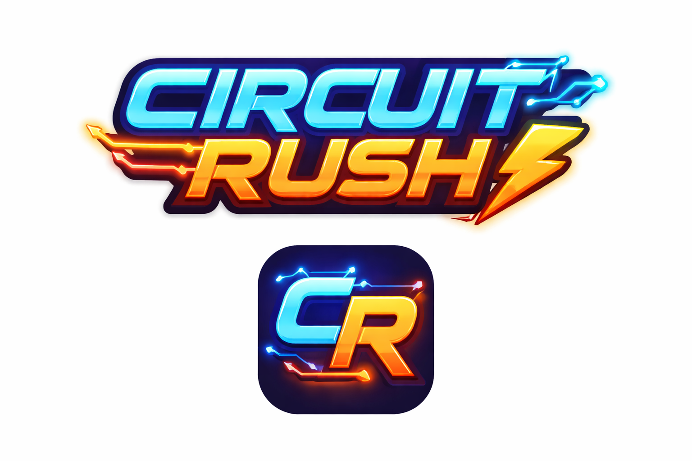
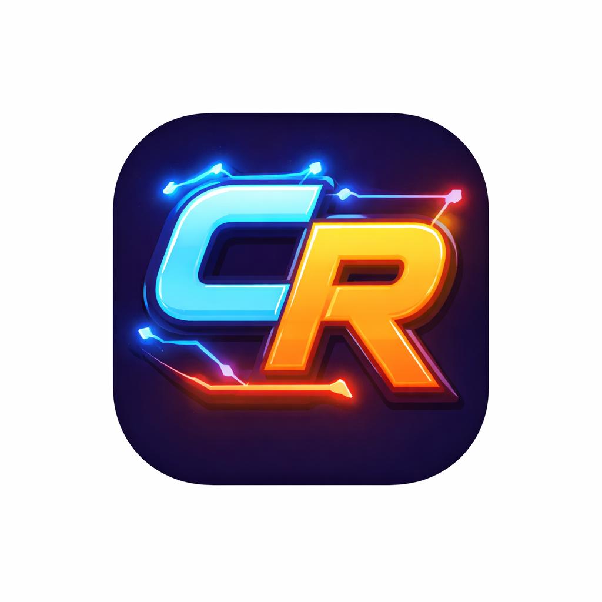

  

## ⚡ Description
**Circuit Rush** is a modern reinterpretation of the classic Snake game, set in a futuristic electric circuit environment.  
The game features a neon-inspired UI, responsive controls, sound effects, and haptic feedback, delivering a fast-paced and immersive arcade experience.

Built with **Kotlin Multiplatform (KMP)** and **Compose Multiplatform**, Circuit Rush is designed to share core logic across platforms while keeping a native look and feel.

## � Supported platforms
This project currently supports:
- **Android**
- **iOS**

Desktop and browser support are planned for future releases.

> ⚠️ Note: Circuit Rush is under active development. Some features may not be fully available or consistent across all platforms yet.

## ✨ Features
Circuit Rush includes:
- A fast and fluid Snake gameplay with an electric circuit theme.
- Neon-styled UI with dark mode aesthetics.
- Direction control via swipe gestures and on-screen controls.
- Sound effects and vibration feedback for in-game actions.
- Score tracking and high-score persistence.
- Pause and resume functionality.

## � Contribution
This project is still evolving, and contributions are very welcome.  
Feel free to open issues, submit pull requests, or suggest improvements such as:
- New gameplay mechanics
- Visual or performance enhancements
- Additional platform support
- Code refactoring and architecture improvements

## ⭐ Find this repository useful?
If you like this project, consider giving it a star and sharing it with others. Your support helps keep the project growing.
